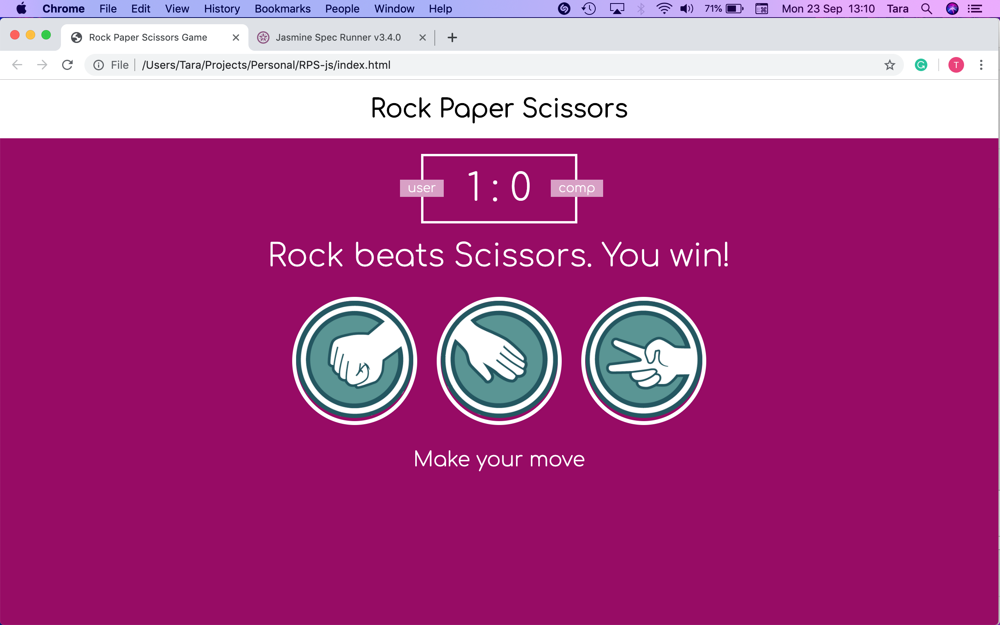

# RPS

## Functionality

- Shows player v computer score.
- User can select from 3 options to make a move.
- Computer randomly selects a move.
- The result is displayed and a point is given to the winner.

## Views

## How to run
